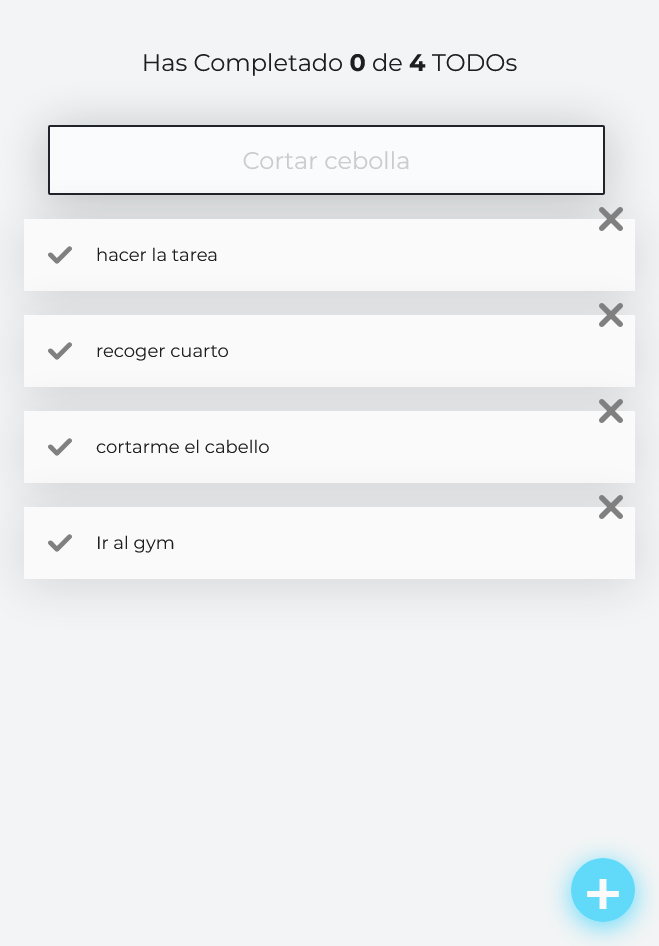

# nmelissarp.todos-machine - Página para crear y organizar tareas

## Table of contents

- [Overview](#overview)
  - [The challenge](#the-challenge)
  - [Screenshot](#screenshot)
  - [Links](#links)
- [My process](#my-process)
  - [Built with](#built-with)

## Overview

### The Challenge
Esta aplicación fue construida con React.js, css y JSX, su principal objetivo es ayudar al usuario a crear tareas, puede marcarlas cómo completadas, y eliminar en caso de ser necesario, también puede filtrar tareas.

### Screenshot

### Links

- Solution URL: [TODO's Machine](https://nmelissarp.github.io/todos-machine/)

## My process

### Built with

- React JS
- JSX
- CSS custom properties
- Mobile-first workflow